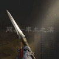
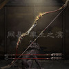
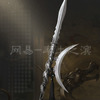
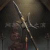
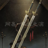
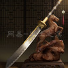
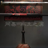

# 率土之滨 · 宝物系统调研（稀世宝物 / 锻造词条）

> **抓取时间**：2026-09-21　**来源**：网易《率土之滨》官网「宝物库」（stzb.163.com/baowu_list.html）**服务端 JSON**，无需 JS 渲染，可直接复现
> **抓取脚本**：`scripts/fetch_gear_data.mjs` → `dateyuan/宝物数据.json`（全量 114 件，含官方原始字段）
> **图片脚本**：`scripts/download_gears.mjs` → `public/gears/`（38 件稀世的立绘 ≈390×676 与图标 100×100）
> 口径：本文件数值/文案全部逐字取自官方 JSON；凡社区来源的补充一律标注「社区口径（待核实）」。

## 〇、速览

| 项目 | 数值 |
|------|------|
| 宝物总数（官方库） | **114**（精品 38 / 罕俦 38 / **稀世 38**） |
| 类型分布 | 长兵 21 / 刀 18 / 弓 18 / 其他 36 / 扇 12 / 剑 9 |
| 稀世宝物 | **38**（战斗类 36 + 内政类 2） |
| 锻造词条组（系列） | **12** 组，共 76 条词条条目，去重后 **42** 个词条名 |
| 每组词条数 | 6 条 × 8 组，**7 条 × 4 组**（组 3 / 7 / 8 / 9）→ 见「§五 待确认项」 |

**宝物自带特效（未锻造）与锻造词条是两套东西**：
- **特效**（官方字段 `skillName` / `skillDesc`）：宝物自带，无需锻造，随宝物突破逐条开启（社区口径：突破 5 级开第 2 条、10 级开第 3 条）；
- **锻造词条**（官方「锻造效果」= `featureGroup` → 词条组）：锻造（玩家俗称「锤」）一次得 **1 条**随机词条，词条从该宝物所属**系列**的词条池里出，池子 6~7 条（本文 §三）。

---

## 一、系统结构（由官方数据反推）

1. **品质三档 + 进阶链**：每件宝物有 `quality`（精品 → 罕俦 → 稀世）与 `obtain`（获取途径）。
   精品由「宝物工匠打造而成」，罕俦/稀世由同系列低一档宝物**进阶**而成，例如：
   `子母刀（精品）→ 两仪刀（罕俦）→ 别鸣（稀世）`、`点钢枪（精品）→ 精钢槊（罕俦）→ 狰角枪（稀世）`。
2. **12 个「系列」**：官方字段 `featureGroup`（1~12）把 114 件宝物分成 12 个系列；**同系列共用同一套锻造词条池**，
   每组恰好是 2~3 条进阶链（不同武器类型可同系列，如刀 / 锤 / 扇 在组 3）。
3. **特效逐条开启**：同一系列内，品质越高特效条数越多（1 条 → 2 条 → 3 条），文案逐字包含前一档，例如
   组 3：`稳固`（精品子母刀）→ `稳固；不移`（罕俦两仪刀）→ `稳固；不移；英才`（稀世别鸣）。
4. **内政宝物**：type `其他` 中有 6 件（含稀世 2 件：大吉 / 天禄）不带战斗特效，改用 `policyName` / `policyDesc`（政策效果）。
5. **官方未解释的字段**（原样保留在 JSON 里，勿臆断）：`woodAdvance` / `ironAdvance` / `woodForge` / `ironForge` / `woodEnchant` / `ironEnchant`
   （推测与木/铁材料消耗、附魔开关有关，官网页面无文字说明）。

---

## 二、38 件【稀世】宝物总表（名称 / 图片 / 未锻造特效）

> 「特效」列 = 官方 `skillName` + `skillDesc`（未锻造效果原文）；「获取途径」= 官方 `obtain`。

| 图片 | 系列 | 名称 | 类型 | 特效（未锻造） | 获取途径 | 立绘 |
|:----:|:----:|------|:----:|----------------|----------|:----:|
|  | G1 | **狰角枪** | 长兵 | **无畏；骁锐；陷阵** 追击战法伤害提高1.0%；攻击属性提高3.0；普通攻击伤害提高12.0% | 由点钢枪进阶而成 | [立绘](../public/gears/gear_1009.jpg) |
|  | G1 | **屈卢** | 长兵 | **骁锐；无畏；破敌** 攻击属性提高2.0；追击战法伤害提高1.0%；造成的攻击伤害无视目标10.0%的防御属性 | 由精钢槊进阶而成 | [立绘](../public/gears/gear_1012.jpg) |
|  | G1 | **戚** | 其他 | **骁锐；稳固；勇猛** 攻击属性提高2.0；防御属性提高3.0；造成的攻击伤害提高8.0% | 由宿铁斧进阶而成 | [立绘](../public/gears/gear_1024.jpg) |
|  | G1 | **少府** | 弓 | **骁锐；陷阵；再战** 攻击属性提高2.0；前4回合普通攻击伤害提高2.0%；第5回合有50%几率获得连击效果 | 由枣木赤弩进阶而成 | [立绘](../public/gears/gear_1060.jpg) |
|  | G2 | **彤素** | 弓 | **骁锐；亢厉；奇袭** 攻击属性提高2.5；主动及追击武将主战法伤害提高1.0%；与目标距离每提高1，造成的攻击伤害提高3.0% | 由犀角弓进阶而成 | [立绘](../public/gears/gear_1003.jpg) |
|  | G2 | **冥山勾月** | 长兵 | **稳固；亢厉；骁锐** 防御属性提高3.0；主动及追击武将主战法伤害提高1.0%；攻击属性提高8.0% | 由新月戟刀进阶而成 | [立绘](../public/gears/gear_1015.jpg) |
|  | G2 | **惊鲵** | 长兵 | **不移；破敌；英才** 受攻击伤害降低1.0%；造成的攻击伤害无视目标1.5%的防御属性；攻击、防御属性提高6.0% | 由玄天戟进阶而成 | [立绘](../public/gears/gear_1018.jpg) |
|  | G2 | **真刚** | 其他 | **破敌；骁锐；盛气** 造成的攻击伤害无视目标1.0%的防御属性；攻击属性提高3.0；正式回合后，前2回合造成的攻击伤害提高20.0% | 由大柯斧进阶而成 | [立绘](../public/gears/gear_1021.jpg) |
|  | G3 | **别鸣** | 刀 | **稳固；不移；英才** 防御属性提高3.0；受所有伤害降低1.0%；谋略、速度属性提高5.0% | 由两仪刀进阶而成 | [立绘](../public/gears/gear_1027.jpg) |
|  | G3 | **博浪** | 其他 | **安贞；坚忍；抖擞** 控制状态下受伤害降低1.0%；受到的主动战法伤害降低2.0%；自身受到的恢复效果提高25.0% | 由八楞镔铁锤进阶而成 | [立绘](../public/gears/gear_1048.jpg) |
|  | G3 | **仁风** | 扇 | **先知；灵动；天资** 受策略伤害降低1.0%；速度属性提高2.0；谋略属性提高8.0% | 由九华扇进阶而成 | [立绘](../public/gears/gear_1054.jpg) |
|  | G4 | **铭鸿** | 刀 | **稳固；英才；亢厉** 防御属性提高3.0；攻击、谋略属性提高1.5；主动及追击武将主战法伤害提高10.0% | 由斜谷环首刀进阶而成 | [立绘](../public/gears/gear_1030.jpg) |
|  | G4 | **锟铻** | 刀 | **稳固；亢厉；英才** 防御属性提高2.0；主动武将主战法伤害提高2.0%；攻击、谋略、速度属性提高8.0 | 由乌金九环刀进阶而成 | [立绘](../public/gears/gear_1033.jpg) |
|  | G4 | **悬翦** | 长兵 | **稳固；骁锐；亢厉** 防御属性提高1.5%；攻击属性提高1.0%；主动战法的攻击伤害提高10.0% | 由回火偃月刀进阶而成 | [立绘](../public/gears/gear_1036.jpg) |
|  | G4 | **徐氏匕首** | 其他 | **灵动；破敌；英才** 速度属性提高1.5；造成的攻击伤害无视目标1.5%的防御属性；攻击、谋略属性提高5.0% | 由寒金匕首进阶而成 | [立绘](../public/gears/gear_1057.jpg) |
|  | G5 | **旌阳万仞** | 剑 | **稳固；亢厉；睚眦** 防御属性提高3.0；主动战法伤害提高1.0%；恐慌、妖术、燃烧、火攻伤害提高10.0% | 由寒淬双股剑进阶而成 | [立绘](../public/gears/gear_1042.jpg) |
|  | G5 | **承影** | 剑 | **骁锐；天资；机先** 攻击属性提高2.5；谋略属性提高2.5；正式回合后，前2次造成的策略伤害提高20.0% | 由随侯剑进阶而成 | [立绘](../public/gears/gear_1045.jpg) |
|  | G5 | **游飘** | 扇 | **先知；妙算；颖悟** 受策略伤害降低1.0%；主动战法的策略伤害提高1.0%；造成的策略伤害无视目标10.0%的谋略属性 | 由雕翎扇进阶而成 | [立绘](../public/gears/gear_1051.jpg) |
|  | G6 | **掩日** | 长兵 | **稳固；亢厉；谋断** 防御属性提高1.5；主动武将主战法伤害提高1.0%；第2次发动需要准备的主动武将主战法时，跳过1个准备回合 | 由赤铅三尖刀进阶而成 | [立绘](../public/gears/gear_1063.jpg) |
|  | G6 | **乌号** | 弓 | **灵动；亢厉；逐胜** 速度属性提高1.5；主动及追击武将主战法伤害提高2.0%；对兵力最低的敌军造成伤害提高15.0% | 由兽皮弓进阶而成 | [立绘](../public/gears/gear_1066.jpg) |
|  | G6 | **钜黍** | 弓 | **无畏；灵动；穿杨** 追击战法伤害提高1.0%；速度属性提高1.0；攻击距离+1 | 由百石弓进阶而成 | [立绘](../public/gears/gear_1084.jpg) |
|  | G6 | **螣蛇** | 长兵 | **灵动；骁锐；豪纵** 速度属性提高1.0；攻击属性提高2.0；主动武将主战法的战法距离+1 | 由蛇矛进阶而成 | [立绘](../public/gears/gear_1087.jpg) |
|  | G6 | **位至三公** | 其他 | **稳固；炎势；燮理** 防御属性提高3.0；火攻、燃烧伤害提高1.0%；正式回合后，自身施加的燃烧效果每回合首次造成伤害后，自身恢复一次兵力（恢复率120.0%) | 由铭文镜进阶而成 | [立绘](../public/gears/gear_1114.jpg) |
|  | G6 | **金鸠** | 其他 | **破敌；亢厉；鸠佑** 造成的攻击伤害无视目标1.0%的防御属性；主动战法伤害提高1.0%；主动武将主战法发动后，自身造成的攻击伤害提高6.0%，可叠加 | 由陶鸠车进阶而成 | [立绘](../public/gears/gear_1123.jpg) |
|  | G7 | **大将** | 其他 | **稳固；强韧；护主** 防御属性提高1.0%；受到的普通攻击伤害降低2.0%；战斗开始后前2回合，援护我军大营 | 由玄头双戟进阶而成 | [立绘](../public/gears/gear_1072.jpg) |
|  | G7 | **泰阿** | 刀 | **骁锐；明镜；强固** 攻击属性提高2.0；谋略属性提高2.0，初始统率值低于3的武将防御属性额外提高1.5；正式回合后，每回合首次受到的伤害降低20.0% | 由赤铜刀进阶而成 | [立绘](../public/gears/gear_1075.jpg) |
|  | G8 | **大橹** | 刀 | **强韧；坚忍；避险** 受到的普通攻击伤害降低1.0%；受到的主动战法伤害降低1.0%；战斗中首次受到伤害后，进入规避状态，免疫下1次受到的伤害 | 由金缕斩马刀进阶而成 | [立绘](../public/gears/gear_1078.jpg) |
|  | G8 | **比翼** | 扇 | **稳固；天资；矜节** 防御属性提高1.0；谋略属性提高1.5；女性武将携带时，主战法造成的恢复效果提高30.0% | 由碧纱进阶而成 | [立绘](../public/gears/gear_1096.jpg) |
|  | G8 | **障日** | 扇 | **坚忍；不移；阵舞** 受到的主动战法伤害降低1.0%；受攻击伤害降低2.0%；女性武将携带时，主战法施加控制的目标，受该控制期间受到的所有伤害提高24.0% | 由聚头扇进阶而成 | [立绘](../public/gears/gear_1099.jpg) |
|  | G9 | **千钧** | 其他 | **稳固；安贞；破障** 防御属性提高3.0；控制状态下受伤害降低1.0%；普通攻击后，移除攻击目标由主动或追击战法带来的1种增益效果 | 由流星锤进阶而成 | [立绘](../public/gears/gear_1081.jpg) |
|  | G10 | **龙鳞** | 其他 | **灵动；亢厉；慑心** 速度属性提高1.5；追击武将主战法伤害提高2.0%；追击武将主战法施加的控制效果增加1回合 | 由龙纹匕首进阶而成 | [立绘](../public/gears/gear_1090.jpg) |
|  | G10 | **貅猊** | 其他 | **坚忍；骁锐；迅猛** 受到的主动战法伤害降低1.0%；攻击属性提高2.0；处于连击状态时，普通攻击伤害提高20.0% | 由宣花斧进阶而成 | [立绘](../public/gears/gear_1093.jpg) |
|  | G10 | **元戎** | 弓 | **陷阵；无畏；迸发** 普通攻击伤害提高1.0%；追击战法伤害提高2.0%；首次发动追击主战法时，额外选取攻击距离内1个目标 | 由连弩进阶而成 | [立绘](../public/gears/gear_1102.jpg) |
|  | G10 | **神锋** | 弓 | **无畏；英才；劲弩** 追击战法伤害提高1.0%；攻击、谋略属性提高1.5；首回合无法普通攻击，第2回合起首次发动普通攻击时，对攻击距离内敌军全体发动1次普通攻击 | 由踏张进阶而成 | [立绘](../public/gears/gear_1105.jpg) |
|  | G11 | **沧海** | 刀 | **稳固；坚忍；破浪** 防御属性提高2.5；受到的主动战法伤害降低1.0%；自身每受到1次伤害，本回合造成所有伤害提升10.0%，最多可叠加10次 | 由百炼钢刀进阶而成 | [立绘](../public/gears/gear_1108.jpg) |
|  | G11 | **星汉** | 剑 | **稳固；不移；归心** 防御属性提高1.0%；受所有伤害降低1.0%；我军全体每发动2次主动战法，自身恢复一定兵力（恢复率150.0%） | 由精铁剑进阶而成 | [立绘](../public/gears/gear_1111.jpg) |
|  | G12 | **大吉** | 其他 | **安居；课增；繁荣**（内政） 商业类内政能力的武将携带时，主城民居税收提升1%；商业类内政能力的武将携带时，势力税收提升50；自身政策提供的势力税收加成提升15% | 由花头筒瓦进阶而成 | [立绘](../public/gears/gear_1117.jpg) |
|  | G12 | **天禄** | 其他 | **取衡；采石；丰收**（内政） 农桑类内政能力的武将携带时，铁矿、木材产量较低的一方提升60；农桑类内政能力的武将携带时，石料产量提升60；自身政策为势力直接提供的资源产量额外增加15% | 由陶火斗进阶而成 | [立绘](../public/gears/gear_1120.jpg) |

点开看 2 件内政稀世宝物（大吉 / 天禄）的完整政策文案

- **大吉**（id 1117，G12）：政策 `安居；课增；繁荣` —— 商业类内政能力的武将携带时，主城民居税收提升1%；商业类内政能力的武将携带时，势力税收提升50；自身政策提供的势力税收加成提升15%
- **天禄**（id 1120，G12）：政策 `取衡；采石；丰收` —— 农桑类内政能力的武将携带时，铁矿、木材产量较低的一方提升60；农桑类内政能力的武将携带时，石料产量提升60；自身政策为势力直接提供的资源产量额外增加15%

---

## 三、每件稀世宝物「可锻造出的词条」（按系列）

> 同系列宝物共用一套词条池；锻造一次从池中随机获得 **1 条**。表内描述为官方原文，`#..#` 为官方的**数值区间**标记（区间随词条数值档位变化，见 §五）。

### 词条组 G1（6 条词条）

**本组稀世宝物**：狰角枪（长兵）、屈卢（长兵）、戚（其他）、少府（弓）

| 词条 | 效果（官方原文） |
|------|------------------|
| **骁锐** | 攻击属性提高#5%~15%# |
| **陷阵** | 普通攻击伤害提高#10%~30%# |
| **强击** | 前#1~5#回合普通攻击不会触发反击 |
| **奔袭** | 追击战法发动率提高#3%~9%# |
| **坚毅** | 前#2~6#回合免疫混乱及暴走 |
| **无畏** | 追击战法伤害提高#10%~30%# |

### 词条组 G2（6 条词条）

**本组稀世宝物**：彤素（弓）、冥山勾月（长兵）、惊鲵（长兵）、真刚（其他）

| 词条 | 效果（官方原文） |
|------|------------------|
| **善谋** | 第4,6回合，造成攻击伤害的武将主战法发动率提高#10%~30%# |
| **坚忍** | 受到的主动战法伤害降低#10%~20%# |
| **骁锐** | 攻击属性提高#5%~15%# |
| **至策** | 主动战法伤害提高#10%~20%# |
| **破敌** | 造成的攻击伤害无视目标#10%~20%#的防御属性 |
| **英勇** | 造成攻击伤害的武将主战法发动率提高#5%~15%# |

### 词条组 G3（7 条词条）

**本组稀世宝物**：别鸣（刀）、博浪（其他）、仁风（扇）

| 词条 | 效果（官方原文） |
|------|------------------|
| **灵动** | 速度属性提高#10~30# |
| **机敏** | 武将主战法发动率提高#3%~9%# |
| **清毅** | 第#5~8#回合武将行动时获得洞察状态 |
| **仁心** | 造成的恢复效果提高#5%~15%# |
| **坚忍** | 受到的主动战法伤害降低#10%~20%# |
| **艮止** | 自身无法普通攻击，谋略属性提高#10~30# |
| **惑言** | 正式回合后武将主战法成功施加的前#1-4#个控制效果(混乱\暴走\怯战\犹豫)增加1回合 |

### 词条组 G4（6 条词条）

**本组稀世宝物**：铭鸿（刀）、锟铻（刀）、悬翦（长兵）、徐氏匕首（其他）

| 词条 | 效果（官方原文） |
|------|------------------|
| **骁锐** | 攻击属性提高#5%~15%# |
| **天资** | 谋略属性提高#5%~15%# |
| **筹算** | 造成策略伤害的武将主战法发动率提高#5%~15%# |
| **识破** | 前#1~4#回合，主动及追击武将主战法造成的伤害无视规避 |
| **亢厉** | 主动及追击武将主战法伤害提高#10%~30%# |
| **英勇** | 造成攻击伤害的武将主战法发动率提高#5%~15%# |

### 词条组 G5（6 条词条）

**本组稀世宝物**：旌阳万仞（剑）、承影（剑）、游飘（扇）

| 词条 | 效果（官方原文） |
|------|------------------|
| **灵动** | 速度属性提高#10~30# |
| **天资** | 谋略属性提高#5%~15%# |
| **颖悟** | 造成的策略伤害无视目标#10%~20%#的谋略属性 |
| **驱火** | 燃烧及火攻伤害提高#10%~30%# |
| **炫惑** | 恐慌及妖术伤害提高#10%~30%# |
| **筹算** | 造成策略伤害的武将主战法发动率提高#5%~15%# |

### 词条组 G6（6 条词条）

**本组稀世宝物**：掩日（长兵）、乌号（弓）、钜黍（弓）、螣蛇（长兵）、位至三公（其他）、金鸠（其他）

| 词条 | 效果（官方原文） |
|------|------------------|
| **熟虑** | 需要准备的主动武将主战法发动率提升#6%~20%# |
| **天资** | 谋略属性提高#5%~15%# |
| **亢厉** | 主动及追击武将主战法伤害提高#10%~30%# |
| **至策** | 主动战法伤害提高#10%~20%# |
| **骁锐** | 攻击属性提高#5%~15%# |
| **击虚** | 正式回合后，目标每存在一种持续性伤害或控制效果，自身对其造成的伤害提升#3%~9%#，最多可计算5种 |

### 词条组 G7（7 条词条）

**本组稀世宝物**：大将（其他）、泰阿（刀）

| 词条 | 效果（官方原文） |
|------|------------------|
| **机敏** | 武将主战法发动率提高#3%~9%# |
| **灵动** | 速度属性提高#10~30# |
| **坚忍** | 受到的主动战法伤害降低#10%~20%# |
| **沉稳** | 受到的指挥战法伤害降低#10%~20%# |
| **稳固** | 防御属性提升#10%~20%# |
| **强韧** | 受到的普通攻击伤害降低#10%~20%# |
| **清毅** | 第#5~8#回合武将行动时获得洞察状态 |

### 词条组 G8（7 条词条）

**本组稀世宝物**：大橹（刀）、比翼（扇）、障日（扇）

| 词条 | 效果（官方原文） |
|------|------------------|
| **稳固** | 防御属性提升#10%~20%# |
| **机敏** | 武将主战法发动率提高#3%~9%# |
| **不屈** | 每次受到伤害后，本回合受到所有伤害降低#3%-9%#，该效果可叠加 |
| **济世** | 主战法每造成一次恢复效果，效果目标下一次受到伤害减少#5%~15%#，该效果可叠加 |
| **威势** | 受到初始统率值低于自身武将的所有伤害降低#10%~20%# |
| **艮止** | 自身无法普通攻击，谋略属性提高#10~30# |
| **惑言** | 正式回合后武将主战法成功施加的前#1-4#个控制效果(混乱\暴走\怯战\犹豫)增加1回合 |

### 词条组 G9（7 条词条）

**本组稀世宝物**：千钧（其他）

| 词条 | 效果（官方原文） |
|------|------------------|
| **机敏** | 武将主战法发动率提高#3%~9%# |
| **不屈** | 每次受到伤害后，本回合受到所有伤害降低#3%-9%#，该效果可叠加 |
| **济世** | 主战法每造成一次恢复效果，效果目标下一次受到伤害减少#5%~15%#，该效果可叠加 |
| **威势** | 受到初始统率值低于自身武将的所有伤害降低#10%~20%# |
| **灵动** | 速度属性提高#10~30# |
| **惑言** | 正式回合后武将主战法成功施加的前#1-4#个控制效果(混乱\暴走\怯战\犹豫)增加1回合 |
| **稳固** | 防御属性提升#10%~20%# |

### 词条组 G10（6 条词条）

**本组稀世宝物**：龙鳞（其他）、貅猊（其他）、元戎（弓）、神锋（弓）

| 词条 | 效果（官方原文） |
|------|------------------|
| **骁锐** | 攻击属性提高#5%~15%# |
| **天资** | 谋略属性提高#5%~15%# |
| **奔袭** | 追击战法发动率提高#3%~9%# |
| **坚毅** | 前#2~6#回合免疫混乱及暴走 |
| **选锋** | 普通攻击后，自身下一次造成策略伤害提高#10%~30%# |
| **蓄锐** | 每2次普通攻击后，自身造成追击战法伤害增加#5%~15%#，可叠加 |

### 词条组 G11（6 条词条）

**本组稀世宝物**：沧海（刀）、星汉（剑）

| 词条 | 效果（官方原文） |
|------|------------------|
| **戒备** | 前2回合受到的所有伤害降低#10%~30%# |
| **济世** | 主战法每造成一次恢复效果，效果目标下一次受到伤害减少#5%~15%#，该效果可叠加 |
| **坚忍** | 受到的主动战法伤害降低#10%~20%# |
| **不屈** | 每次受到伤害后，本回合受到所有伤害降低#3%-9%#，该效果可叠加 |
| **不懈** | 自身每低于初始兵力15%，受到的恢复效果提升#3%~9%# |
| **威势** | 受到初始统率值低于自身武将的所有伤害降低#10%~20%# |

### 词条组 G12（6 条词条）

**本组稀世宝物**：大吉（其他）、天禄（其他）

| 词条 | 效果（官方原文） |
|------|------------------|
| **商盈** | 自身政策提供的势力税收加成额外提升#10%~30%# |
| **税丰** | 每有2名商业类武将施政，自身政策提供的税收加成额外提升#3%~9%# |
| **富庶** | 每有1名商业类武将施政，势力税收提升#50~150# |
| **采伐** | 自身政策为势力直接提供的木材、铁矿产量加成提升#5%~15%# |
| **植垦** | 自身政策为势力直接提供的石料、粮草产量加成提升#5%~15%# |
| **取衡** | 每有一位农桑类武将施政，四项资源中产量最少的资源产量提升#50~150# |

---

## 四、词条词典（去重 42 条，名称 → 效果描述）

| 词条 | 效果描述（官方原文） | 出现在（组） |
|------|----------------------|--------------|
| **奔袭** ×2 | 追击战法发动率提高#3%~9%# | G1、G10 |
| **不屈** ×3 | 每次受到伤害后，本回合受到所有伤害降低#3%-9%#，该效果可叠加 | G8、G9、G11 |
| **不懈** | 自身每低于初始兵力15%，受到的恢复效果提升#3%~9%# | G11 |
| **采伐** | 自身政策为势力直接提供的木材、铁矿产量加成提升#5%~15%# | G12 |
| **沉稳** | 受到的指挥战法伤害降低#10%~20%# | G7 |
| **筹算** ×2 | 造成策略伤害的武将主战法发动率提高#5%~15%# | G4、G5 |
| **富庶** | 每有1名商业类武将施政，势力税收提升#50~150# | G12 |
| **艮止** ×2 | 自身无法普通攻击，谋略属性提高#10~30# | G3、G8 |
| **惑言** ×3 | 正式回合后武将主战法成功施加的前#1-4#个控制效果(混乱\暴走\怯战\犹豫)增加1回合 | G3、G8、G9 |
| **击虚** | 正式回合后，目标每存在一种持续性伤害或控制效果，自身对其造成的伤害提升#3%~9%#，最多可计算5种 | G6 |
| **机敏** ×4 | 武将主战法发动率提高#3%~9%# | G3、G7、G8、G9 |
| **济世** ×3 | 主战法每造成一次恢复效果，效果目标下一次受到伤害减少#5%~15%#，该效果可叠加 | G8、G9、G11 |
| **坚忍** ×4 | 受到的主动战法伤害降低#10%~20%# | G2、G3、G7、G11 |
| **坚毅** ×2 | 前#2~6#回合免疫混乱及暴走 | G1、G10 |
| **戒备** | 前2回合受到的所有伤害降低#10%~30%# | G11 |
| **亢厉** ×2 | 主动及追击武将主战法伤害提高#10%~30%# | G4、G6 |
| **灵动** ×4 | 速度属性提高#10~30# | G3、G5、G7、G9 |
| **破敌** | 造成的攻击伤害无视目标#10%~20%#的防御属性 | G2 |
| **强击** | 前#1~5#回合普通攻击不会触发反击 | G1 |
| **强韧** | 受到的普通攻击伤害降低#10%~20%# | G7 |
| **清毅** ×2 | 第#5~8#回合武将行动时获得洞察状态 | G3、G7 |
| **驱火** | 燃烧及火攻伤害提高#10%~30%# | G5 |
| **取衡** | 每有一位农桑类武将施政，四项资源中产量最少的资源产量提升#50~150# | G12 |
| **仁心** | 造成的恢复效果提高#5%~15%# | G3 |
| **善谋** | 第4,6回合，造成攻击伤害的武将主战法发动率提高#10%~30%# | G2 |
| **商盈** | 自身政策提供的势力税收加成额外提升#10%~30%# | G12 |
| **识破** | 前#1~4#回合，主动及追击武将主战法造成的伤害无视规避 | G4 |
| **熟虑** | 需要准备的主动武将主战法发动率提升#6%~20%# | G6 |
| **税丰** | 每有2名商业类武将施政，自身政策提供的税收加成额外提升#3%~9%# | G12 |
| **天资** ×4 | 谋略属性提高#5%~15%# | G4、G5、G6、G10 |
| **威势** ×3 | 受到初始统率值低于自身武将的所有伤害降低#10%~20%# | G8、G9、G11 |
| **稳固** ×3 | 防御属性提升#10%~20%# | G7、G8、G9 |
| **无畏** | 追击战法伤害提高#10%~30%# | G1 |
| **陷阵** | 普通攻击伤害提高#10%~30%# | G1 |
| **骁锐** ×5 | 攻击属性提高#5%~15%# | G1、G2、G4、G6、G10 |
| **蓄锐** | 每2次普通攻击后，自身造成追击战法伤害增加#5%~15%#，可叠加 | G10 |
| **选锋** | 普通攻击后，自身下一次造成策略伤害提高#10%~30%# | G10 |
| **炫惑** | 恐慌及妖术伤害提高#10%~30%# | G5 |
| **英勇** ×2 | 造成攻击伤害的武将主战法发动率提高#5%~15%# | G2、G4 |
| **颖悟** | 造成的策略伤害无视目标#10%~20%#的谋略属性 | G5 |
| **植垦** | 自身政策为势力直接提供的石料、粮草产量加成提升#5%~15%# | G12 |
| **至策** ×2 | 主动战法伤害提高#10%~20%# | G2、G6 |

---

## 五、待确认项（官网数据与社区口径的差异，实现前需定夺）

1. **词条池到底 6 条还是 7 条**：官方 12 组里 8 组为 6 条，**4 组为 7 条**（G3 / G7 / G8 / G9），涉及 9 件稀世：
   别鸣、博浪、仁风、大将、泰阿、大橹、比翼、障日、千钧。你的口径是「锻造 = 6 选 1」，
   而官网详情页（`stzb.163.com/baowulist/{id}.html` 的「锻造效果」）确实渲染 7 条 —— 建议进游戏 UI 复核，可能是官网数据冗余。
2. **数值区间如何取**：官方 desc 形如 `#5%~15%` / `#10~30`（区间标记）。社区口径：词条数值分**蓝 / 粉 / 红**三档
   （红 = 打到区间上限，粉 = 次优），锻造（锤）可重 roll 词条与数值，**最多 7 次**，第一下只耗材料、之后耗玉符；
   存在平跳 / 跳档 / 降档（蓝可降、粉极少降、红可掉回粉）。**以上为社区口径（待核实）**，官方数据未体现。
3. **特效开启等级**：社区口径「第一次突破 5 级开第 2 词条、第二次突破 10 级开第 3 词条」；官方仅给逐条递增的文案。
4. **同名叠加规则**：部分宝物自带特效与词条池同名（如 戚 自带 `骁锐`，其 G1 池里也有 `骁锐`），
   两者是否叠加 / 取高 / 不可重复，官方无说明。
5. **原始字段含义**：`woodAdvance` / `ironAdvance` / `woodForge` / `ironForge` / `woodEnchant` / `ironEnchant` 未经官方文字解释。
6. **社区来源的锻造消耗**（30000 铜钱打造胚子、玉符消耗 800 起每次 +400 等）**未采信**，仅作背景。

---

## 六、数据来源与接口（可复现）

| 用途 | 地址 |
|------|------|
| 宝物库列表页（人看） | https://stzb.163.com/baowu_list.html |
| 单件宝物详情页（含「锻造效果」词条组） | https://stzb.163.com/baowulist/{id}.html |
| **宝物全量 JSON**（114 件） | https://g0.gph.netease.com/ngsocial/community/stzb/cfg/gear_id.json?gameid=g10 |
| **锻造词条组 JSON**（12 组） | https://g0.gph.netease.com/ngsocial/community/stzb/cfg/gear_feature_extra.json?gameid=g10 |
| 立绘（详情页展示 150×240，文件 ≈390×676） | https://g0.gph.netease.com/ngsocial/community/stzb/cn/gears/watermark/gear_watermark_{id}.jpg?gameid=g10 |
| 图标 100×100 | https://g0.gph.netease.com/ngsocial/community/stzb/cn/gears/gear_icon/gear_icon_{id}.jpg?gameid=g10 |

> 注：桌面版 / 移动版宝物库页面本身是 JS 渲染，正文来自上面两个 JSON；`gear_id.json` 里的 `featureGroup`
> 与详情页 HTML 的 `data-xiaoguo` 字段一致（已用 别鸣(3) / 泰阿(7) / 少府(1) / 沧海(11) / 大吉(12) 核对）。

**本地文件**
- `dateyuan/宝物数据.json`：114 件宝物 + 12 组词条（官方字段原样 + 派生 `affixPool` / 图片路径）
- `public/gears/gear_{id}.jpg`（立绘）、`public/gears/gear_{id}_s.jpg`（图标）：本次仅下载 38 件稀世
- 重新抓取：`node scripts/fetch_gear_data.mjs`；重下图片：`node scripts/download_gears.mjs`（`--all` 下全部 114 件）

---

## 七、与现有引擎对接的初步观察（**待确认，勿直接实现**）

现有引擎已有：属性增减（点/百分比）、各类 `damage_boost` / `damage_reduce`、DoT（燃烧/恐慌/妖术/诅咒）、
控制（混乱/暴走/怯战/犹豫）、洞察、连击、规避、恢复/急救、发动率加成、距离、无视防御等。
按词条语义粗分：

- **纯属性**：骁锐(攻击) / 天资(谋略) / 稳固(防御) / 灵动(速度) / 英才(谋略+速度) / 强固 / 明镜(谋略) 等 → 属性 buff
- **增减伤**：陷阵 / 无畏 / 至策 / 亢厉 / 击虚 / 选锋 / 蓄锐 / 戒备 / 坚忍 / 沉稳 / 强韧 / 威势 / 不屈 等 → `damage_boost` / `damage_reduce`（可按来源类型限定）
- **发动率**：机敏 / 英勇 / 筹算 / 熟虑 / 奔袭 → 主战法/战法类型发动率加成
- **特殊性**：坚毅（免疫混乱暴走）/ 清毅（洞察）/ 惑言（控制时长 +1 回合）/ 艮止（禁普攻换谋略）/ 识破（无视规避）/ 破敌·颖悟（无视防御/谋略）等
  → 多数对应引擎已有状态，但**「控制时长 +1 回合」「无视规避」「无视防御」「禁普攻」**需逐一确认现有实现是否可直接复用。
- **内政/政策词条（G12：商盈/税丰/富庶/采伐/植垦/取衡）与战斗引擎无关**，属大地图经营系统。

> ⚠️ 结论：**先不要实现**。请先确认 §五 的 1~4 项（尤其词条池 6/7 条、数值区间与档位），再决定数据入库形态。

---

## 八、强化成长与档位数值（2026-09-21 第二轮补充）

> 用户已给口径（宝物默认 10 级；1~5 级强化第 1 条效果、5~10 级强化第 2 条效果、第 3 条固定；效果不与其他任何效果冲突、纯提升可叠加）。
> 本节补齐两块数据：① **每次强化提升多少**；② **蓝/粉/红档位区间**。

### 8.1 官方机制原文（网易公告，GBK 页面，逐字摘录）

来源：https://stzb.163.com/notice/2020/06/03/20399_884741.html 《率土之滨》宝物系统介绍（2020-06-03）

**【宝物强化】**
- 每次强化可以选择一个**宝物基础效果**提升，**精品宝物仅可强化一项效果，罕俦宝物可选择本次需要强化的效果**。
- 强化具有成功率，成功后选择的效果将会提升，宝物强化等级升一级。
- 强化失败时，下次强化成功率将会提升，提升效果可累加；强化成功后成功率变为初始成功率。
- **精品和罕俦宝物强化等级最多可以到五级，之后需要进阶至下一等级。**

**【宝物进阶】**
- 精品/罕俦强化至 5 级后可进阶（陈情工匠）；**进阶后解锁宝物对应的基础效果**；进阶后**强化等级变为 0 级**。
- 精品→罕俦→稀世，共两次进阶；罕俦需武将 20 级、稀世需 30 级才可装备。

**【宝物锻造】**
- **未经锻造的稀世宝物**可进行锻造，首次锻造需要消耗材料；**锻造过程中可尝试 7 次**，每次获得一个随机锻造效果；
  锻造过程中可通过**淬火**锁定对应效果；**淬火后永久无法再次锻造**；最多持续 24 小时。

### 8.2 关键结论：官方库里的特效数值 = **每次强化的增量**

大神「率土宝物辞典」系列（作者 胤月天 · 率土军师团）原文（宝物：玄铁剑，G5 剑系）：
- 一阶词条【骁锐】——"提高攻击力。**每次强化可以提高 2.5 点攻击力**。"
- 二阶词条【天资】——"提高谋略。**每次强化可以提高 2.5 点谋略**。"
- 三阶词条【机先】——"正式回合开始后，前两次造成的策略伤害提高 **20%**。"（**固定值**，无"每次强化"表述）

与官方库对照（`dateyuan/宝物数据.json`，玄铁剑 id 1043）：`skillDesc` = 「攻击属性提高2.5；谋略属性提高2.5；…」，
其高阶形态 承影（id 1045，稀世）三阶【机先】=「正式回合后，前2次造成的策略伤害提高20.0%」——**逐字吻合**。
来源：https://ds.163.com/feed/600a888873b05152af122756/（该页为 SSR，正文写在 `__NUXT__` 里，可直接抓）

> ⚠️ **证据强度**：该"每次强化 = 官方数值"的读法来自**大神攻略组文章原文**（非官方公告），目前只找到 1 篇逐字印证；
> 与之矛盾的解释是"官方数值 = 满级总值"（则每级增量 = 官方值 ÷ 强化上限）。两者对**默认 10 级口径**的影响：
> 前者第 1/2 条 = 官方值 ×5，后者 = 官方值 ×5 的分布不变但单级增量不同——**建议在游戏内 UI 复核一次**（看一眼 1 级宝物的面板数值即可判定）。

**落地模型（写进方案）**：

| 项 | 规则 |
|----|------|
| 一阶 / 二阶特效 | 数值 = **官方数值 × 已强化次数**（0 次 = 未强化） |
| 三阶特效 | **固定值 = 官方数值**，不随强化变化 |
| 强化上限 | 精品 / 罕俦 = 5 级（之后必须进阶，进阶后清零）；稀世 = 10 级 |
| 本引擎默认（10 级） | 一阶 = 官方值 **×5**、二阶 = 官方值 **×5**、三阶 = 官方值 **×1** |

### 8.3 锻造词条「蓝 / 粉 / 红」档位表（社区口径，目前唯一公开来源）

来源：纽扣助手 2024-12-12《率土之滨打宝攻略》内嵌「宝物档位表」图（`https://m.niucoo.cn/news/61.html`）。
作者自查勘误原文：「注意表里面有个小问题，标注错了，这里指出，**戒备十五档应该在 30％那一栏**」。

**档位阶梯（行：五档 → 十五档；表内缺十四档）**

| 档位 | 灵动·艮止 | 筹算·英勇·骁锐·天资·仁心·强韧·蓄锐·济世 | 至策·颖悟·坚忍·破敌·稳固·沉稳·威势 | 眩惑·亢厉·善谋·陷阵·驱火·无畏·选锋·戒备 | 机敏·奔袭·击虚·不懈 | 清毅 | 熟虑 | 惑言·识破 | 强击 | 坚毅 |
|:----:|:----:|:----:|:----:|:----:|:----:|:----:|:----:|:----:|:----:|:----:|
| 五档 | 10点 | 5% | 10% | 10% | — | — | 6% | — | — | — |
| 六档 | 12点 | 6% | 11% | 12% | — | — | 8% | — | — | — |
| 七档 | 14点 | 7% | 12% | 14% | — | — | 10% | 第一回合 | 前1回合 | 前2回合 |
| 八档 | 16点 | 8% | 13% | 16% | 3% | 5 | — | — | — | — |
| 九档 | 18点 | 9% | 14% | 18% | 4% | — | 12% | — | 前2回合 | 前3回合 |
| 十档 | 20点 | 10% | 15% | 20% | 5% | — | — | — | — | — |
| 十一档（蓝极） | 22点 | 10% | 16% | 22% | 6% | 6 | 14% | 第二回合 | 前3回合 | 前4回合 |
| 十二档（粉·浅） | 24点 | 10% | 17% | 24% | 7% | — | 16% | — | — | — |
| 十三档（粉·深） | 26点 | 13% | 18% | 26% | 8% | 7 | 18% | 第三回合 | 前4回合 | 前5回合 |
| 十五档（红·满） | 30点 | 15% | 20% | 30% | 9% | 8 | 20% | — | 前5回合 | 前6回合 |

**颜色带（按图内行底色实采样）**：蓝 = 五~十档（浅蓝）+ 十一档（"蓝极"，中蓝）；粉 = 十二档（浅粉）、十三档（深粉）（含十四档）；
红 = 十五档（满值）。各族阶梯的**首末值 = 官方 `#min~max#` 区间**（自洽性校验通过）。

⚠️ **已知风险**：该表为社区自制且内部有矛盾（骁锐列十/十一/十二档均为 10%，13 / 15 档却是 13% / 15%；缺十四档），
**不建议把它当作"唯一合法值集合"**。方案采用：**数值在官方区间内自由取值（连续）**，蓝/粉/红仅作**颜色提示**。

### 8.4 其它补充事实（社区口径，标注来源）

- 打造：工匠/陈情打造，出「次品 / 精品」；次品不可强化（官方公告亦如此表述）。
- 进阶：精品 5 级 → 罕俦，罕俦 5 级 → 稀世（官方公告：精品与罕俦上限均为 5 级）；稀世上限 10 级。
  另有社区页面称「罕俦 10 级进阶」，与官方公告冲突，**以官方公告为准**。
- 锻造：可尝试 **7 次**（官方公告已确认"7 次"）；社区补充「第一次只耗材料、之后耗玉符，数值分平跳/跳档/降档」——**未采信数量**。
- 拆解：拆解稀世可得闪铁或紫檀（社区口径）。
